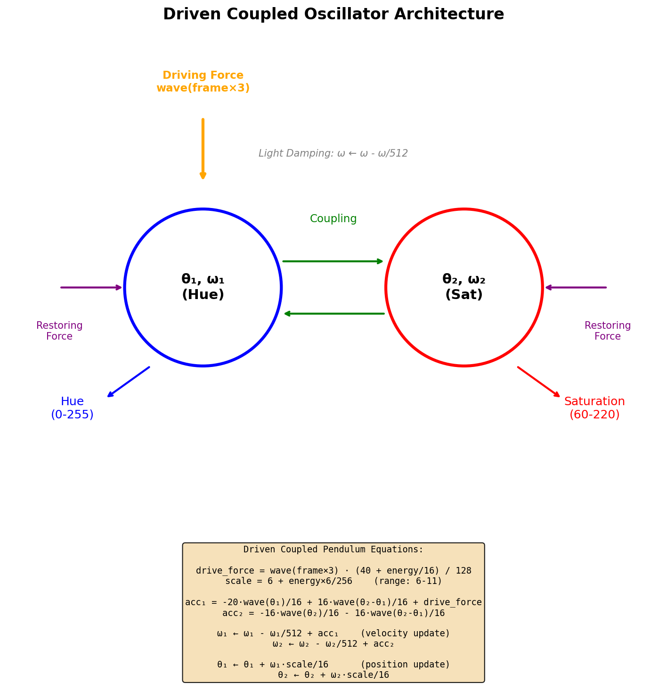
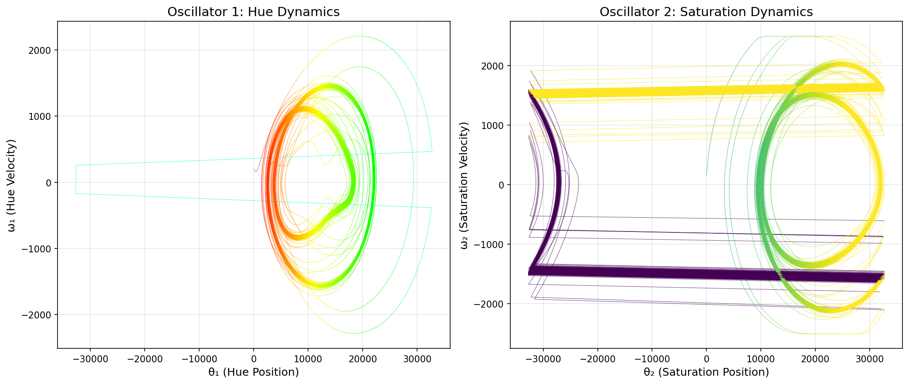
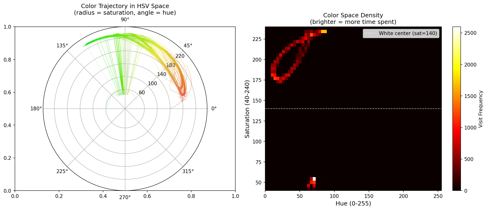
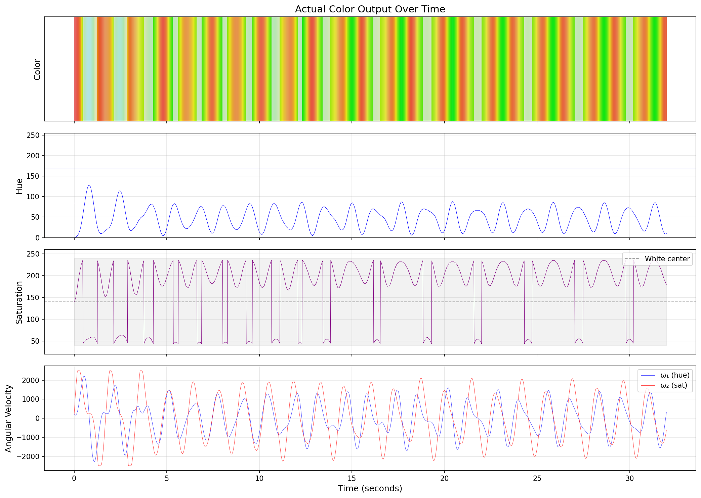
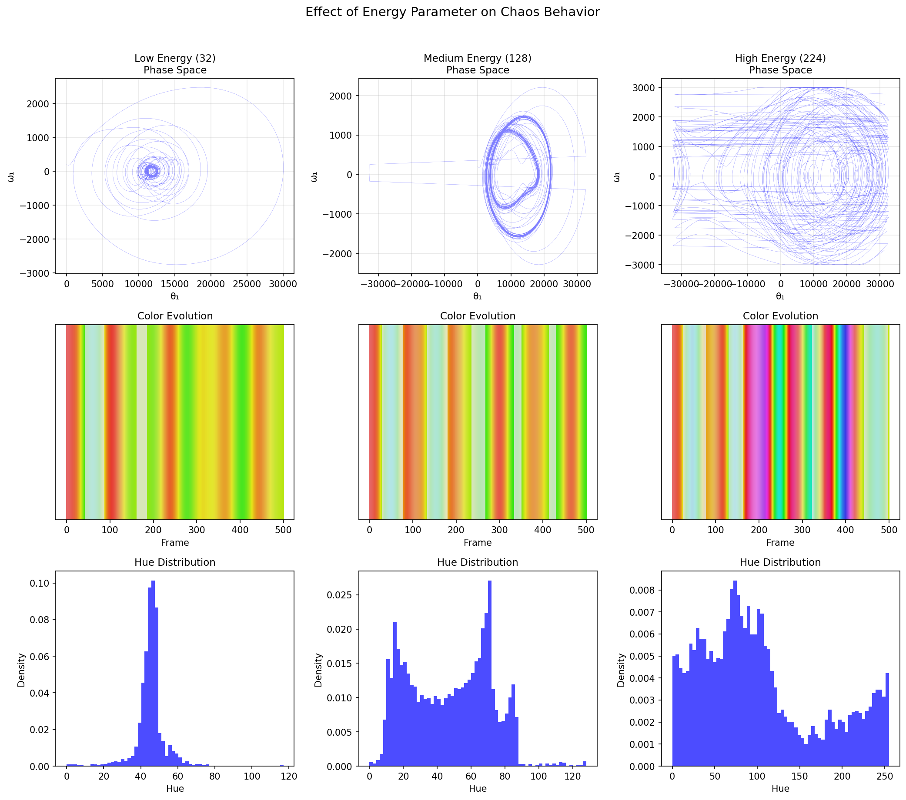
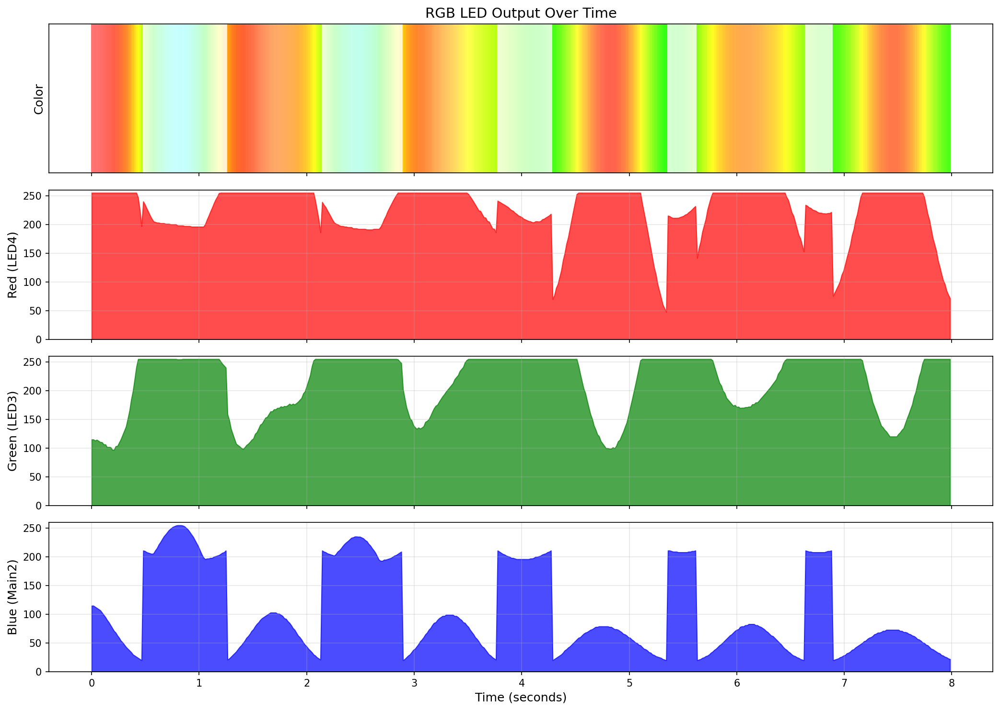

# Chaotic Pendulum Color Animation: Technical Deep Dive

This document explains the physics and mathematics behind the chaotic pendulum
color animation mode implemented for the Emisar D4K-3ch flashlight.

## Overview

The chaos mode creates organic, non-repeating color animations by simulating
two coupled oscillators - a simplified model of a double pendulum. This
approach produces visually interesting patterns that:

1. Never exactly repeat (chaotic dynamics)
2. Stay centered around white (controlled saturation)
3. Occasionally visit vivid colors (excursions to gamut edges)
4. Flow smoothly without jarring transitions

## Coupled Oscillator Architecture

The animation uses two coupled oscillators, each with position (θ) and
velocity (ω) state variables:



**Oscillator 1** controls **hue** (color wheel position):
- θ₁ maps to hue value (0-255)
- ω₁ determines how fast hue changes

**Oscillator 2** controls **saturation** (color intensity):
- θ₂ maps to saturation offset from center
- ω₂ determines saturation oscillation rate

The key to chaos is the **coupling term**: each oscillator's acceleration
depends on the difference between the two positions. This creates sensitive
dependence on initial conditions - the hallmark of chaotic systems.

## Mathematical Model

### Equations of Motion

The driven coupled pendulum equations, adapted for integer arithmetic:

```
drive = wave(frame * 3)
drive_force = drive · (40 + energy/16) / 128

acc₁ = -20·wave(θ₁)/16 + 16·wave(θ₂-θ₁)/16 + drive_force
acc₂ = -16·wave(θ₂)/16 - 16·wave(θ₂-θ₁)/16

ω₁ ← ω₁ - ω₁/512 + acc₁
ω₂ ← ω₂ - ω₂/512 + acc₂

θ₁ ← θ₁ + ω₁·scale/16
θ₂ ← θ₂ + ω₂·scale/16
```

Where:
- `wave()` is a triangle wave approximating sine (using existing firmware function)
- `scale = 6 + energy×6/256` provides user-adjustable speed (6-11, tuned for perceptual range)
- `drive_force` is a periodic driving term that sustains oscillations (amplitude 40-56)
- The `-ω/512` term provides very light damping to prevent runaway
- The coupling term `wave(θ₂-θ₁)` creates energy transfer between oscillators

### Why a Driven Pendulum?

A simple damped pendulum eventually stops. To create sustained, chaotic motion
we add a periodic driving force. When the driving frequency is incommensurate
with the natural frequencies, the system exhibits chaos - sensitive dependence
on initial conditions with bounded, non-repeating trajectories.

### Why Triangle Wave?

The firmware already has `triangle_wave()` for other purposes. Using it
instead of a true sine lookup table:

1. Saves precious flash memory
2. Provides similar dynamics (continuous, periodic)
3. Creates slightly different attractor shapes (more angular)

The triangle wave maps input 0-255 to output 0-255-0 (rising then falling).
We convert to signed (-128 to +127) for the pendulum physics.

## Phase Space Analysis

Running the simulation for 50,000 frames reveals the chaotic attractor:



**Left panel**: Oscillator 1 (hue) phase space. The trajectory never exactly
repeats but stays bounded, filling a region of phase space over time.

**Right panel**: Oscillator 2 (saturation) phase space. The coupling creates
correlated but distinct dynamics.

Key observations:
- Trajectories are bounded (damping prevents explosion)
- Space is not uniformly filled (attractor structure)
- Multiple "lobes" indicate chaotic switching between behaviors

## Color Space Trajectory

The chaos maps to colors via HSV:



**Left (polar plot)**: Angle = hue, radius = saturation. The trajectory
shows how colors roam through the space.

**Right (heatmap)**: Density of visits to different hue/saturation
combinations. Brighter areas indicate more time spent at those colors.

The white dashed line at saturation=140 marks the nominal center point.

### Saturation Mapping: Square Root Expansion

To spend more time at vivid, saturated colors rather than near white,
the raw θ₂ oscillator value undergoes a **square root-like expansion**:

```
sat_raw = θ₂ >> 9                    // -128 to +127
sat_abs = |sat_raw|
inv = 128 - sat_abs
sat_expanded = 128 - (inv²) / 128    // sqrt-ish curve
sat = 140 + sign(sat_raw) × sat_expanded
```

This transformation pushes small values (near white) outward toward
the saturated extremes. The result: the animation dwells longer on
vivid colors and passes quickly through the white region.

## Time Evolution

Watching the color change over time:



From top to bottom:
1. **Actual color output** - the LED color over ~30 seconds
2. **Hue value** - oscillating around 0-90 range (red-orange-yellow region)
3. **Saturation** - oscillating around 140-200 (biased toward white)
4. **Angular velocities** - showing the chaotic dynamics driving the animation

The color evolution is smooth but non-repeating. Notice how the velocities
(bottom panel) show irregular oscillations - this is the chaos creating
organic, unpredictable motion.

## Energy Parameter Effect

The user can adjust animation speed via 3H (click-click-hold):



**Low energy (32)**: Slow, meditative color drift. The phase space shows
tighter orbits and slower transitions.

**Medium energy (128)**: Balanced motion with clear chaotic dynamics.
Good for ambient lighting.

**High energy (224)**: Fast, energetic color changes. The phase space
fills more rapidly and transitions happen quickly.

The energy parameter scales the position update rate without changing
the fundamental dynamics - like adjusting the playback speed of a
chaotic system.

### Perceptual Tuning

The energy-to-speed mapping was carefully tuned for the perceptually
useful range:

- **Scale range 6-11** (not 4-19): Very low speeds looked static and
  boring, while very high speeds blurred into white
- **Drive amplitude 40-56** (not 32-63): Narrower range maintains
  interesting dynamics across all energy settings

### Visual Feedback During Adjustment

When adjusting energy via 3H:
- **Brightness shows energy level**: Dim = slow, bright = fast
- **Blink on wrap-around**: Brief off when value wraps 255→0 or 0→255
- **Restore on release**: Original brightness returns when released

This lets users see exactly where they are in the energy range without
needing to guess based on animation speed alone.

## RGB Channel Output

The HSV colors convert to individual LED channel outputs:



The D4K-3ch maps RGB to physical LEDs:
- **Red** → LED4 (one emitter)
- **Green** → LED3 (one emitter)
- **Blue** → Main2 (two emitters, cool white approximation)

The individual channel plots show how each LED's brightness varies over
time. The smooth, out-of-phase oscillations create the organic color
mixing effect.

## Implementation Details

### Memory Usage

The chaos state requires only 8 bytes of RAM:
- `theta1`, `omega1`: 2 × int16_t = 4 bytes
- `theta2`, `omega2`: 2 × int16_t = 4 bytes

### CPU Cycles

Each physics update performs:
- 3 triangle wave lookups
- ~20 integer multiplications/divisions
- ~15 additions/subtractions
- 1 HSV to RGB conversion

This runs comfortably within the 16ms frame budget on the ATtiny1634
at 8MHz.

### Continuous Animation

The animation runs via a hook in the main `EV_tick` handler that calls
`set_level(actual_level)` on every frame when chaos mode is active.
This ensures:

1. Animation continues even when brightness is static
2. Smooth transitions during thermal stepdown
3. No visible stuttering or frame drops

The implementation required adding `USE_CHAOS_MODE` to enable this
tick-driven animation, as standard channel modes only update when
brightness changes.

## Comparison to True Double Pendulum

A physical double pendulum exhibits chaos due to:
- Gravitational potential energy
- Rotational kinetic energy
- Energy transfer between masses

Our simplified model captures the essential chaotic behavior with:
- Triangle wave "gravity" (restoring force)
- Velocity as angular momentum analog
- Coupling term for energy transfer

The result is visually similar chaos with far less computational cost.

## Future Enhancements

Possible improvements for future versions:

1. **3D attractor**: Add a third oscillator for value/brightness modulation
2. **Attractor selection**: Different coupling constants for different "moods"
3. **External forcing**: Sync to music or button presses
4. **Lorenz mode**: True Lorenz attractor for more dramatic chaos

## References

1. Strogatz, S. H. (2015). *Nonlinear Dynamics and Chaos*. Westview Press.
2. Shinbrot, T., et al. (1992). "Chaos in a double pendulum." *American
   Journal of Physics*, 60(6), 491-499.
3. Anduril firmware: https://github.com/ToyKeeper/anduril

---

*Document generated with simulations matching the exact firmware implementation
in `hw/hank/emisar-d4k-3ch/hwdef.c`.*
