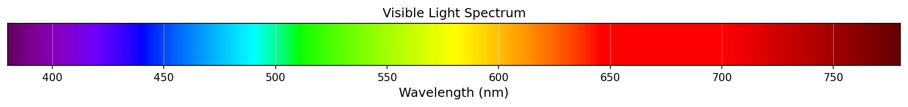
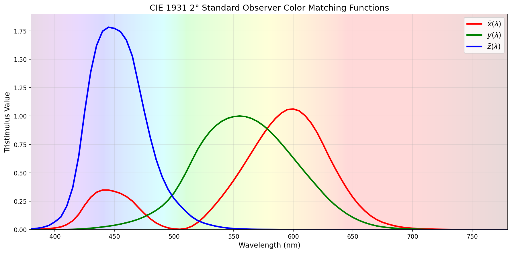
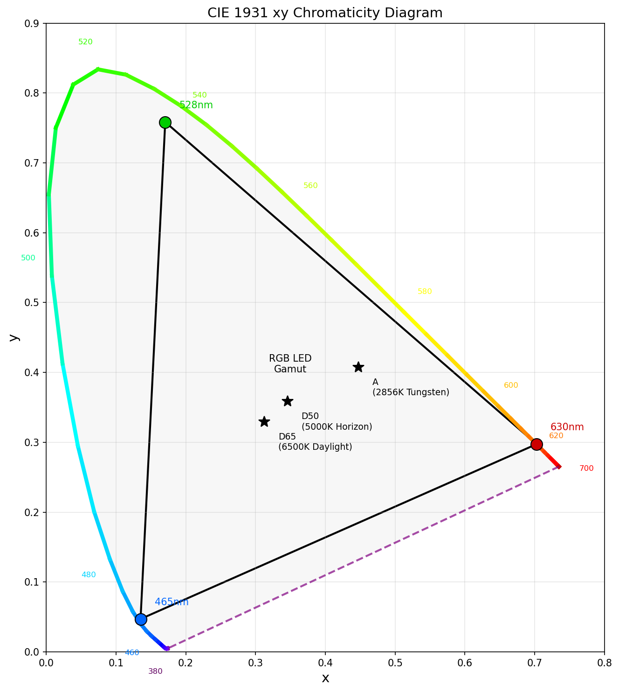
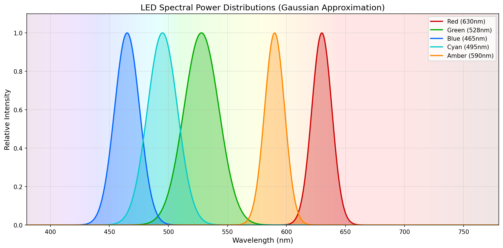
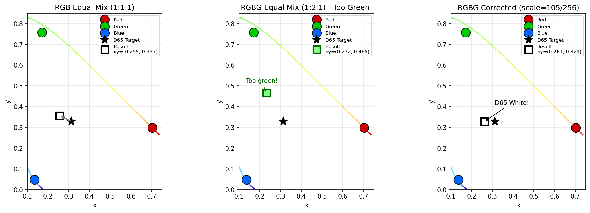
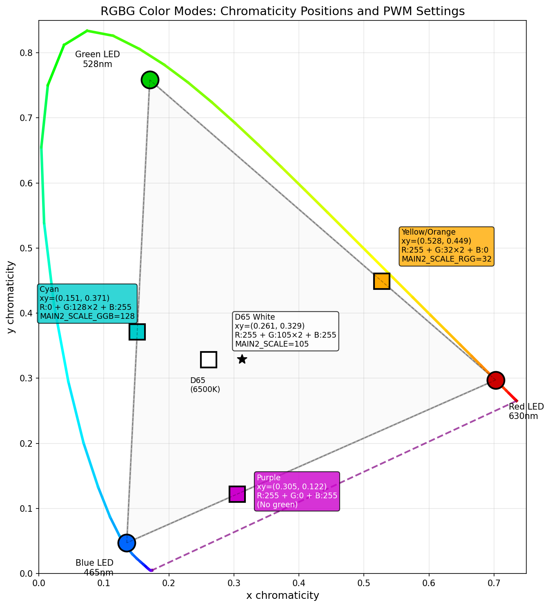
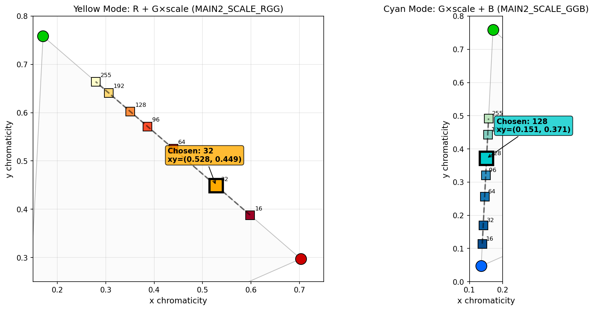
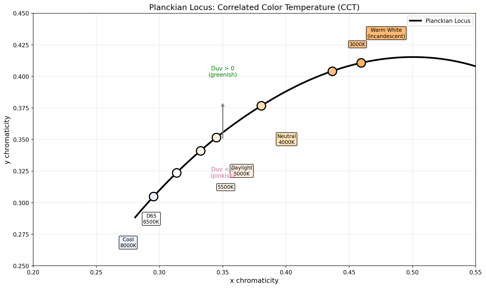

# Color Science for Multi-Channel Flashlights

## Introduction

Modern multi-channel flashlights like the Emisar D4K combine multiple colored LEDs to produce a wide range of colors. But how do we know *how much* of each LED to use to get a specific color? This document explains the color science behind LED mixing and how Anduril calculates optimal channel ratios.



---

## Part 1: How We See Color

### The Human Eye

The human eye contains three types of cone cells, each sensitive to different wavelengths of light:

| Cone Type | Peak Sensitivity | Color Range |
|-----------|------------------|-------------|
| S-cones (Short) | ~420nm | Blue-violet |
| M-cones (Medium) | ~530nm | Green |
| L-cones (Long) | ~560nm | Red-yellow |

When light enters the eye, each cone type responds according to its sensitivity curve. The *combination* of these three signals is what we perceive as color.

### Metamerism: The Key Insight

Here's the crucial insight that makes color mixing possible:

> **Two physically different light spectra can appear identical if they stimulate the three cone types in the same ratio.**

This is called **metamerism**. It means we don't need to recreate the exact spectrum of daylight—we just need to stimulate the eye in the same *proportion*. Daylight has a continuous spectrum across all wavelengths, but a mix of just three narrow-band LEDs (red, green, blue) can produce the same perception of white light.

---

## Part 2: The CIE 1931 Color Space

In 1931, the **Commission Internationale de l'Éclairage** (CIE) standardized how to describe color mathematically. They measured the average human cone response and created three **Color Matching Functions**: x̄(λ), ȳ(λ), z̄(λ).

### Color Matching Functions

These functions describe how much each "virtual primary" is needed to match any wavelength:



The three curves show the CIE 1931 2° Standard Observer:
- **x̄(λ)** (red curve) - peaks in red-orange region
- **ȳ(λ)** (green curve) - matches human luminance perception, peaks at 555nm
- **z̄(λ)** (blue curve) - peaks in blue-violet region

### Calculating XYZ Tristimulus Values

For any light source with spectral power distribution S(λ), we calculate its color by integrating against the CMFs:

$$X = \int_{380}^{780} S(\lambda) \cdot \bar{x}(\lambda) \, d\lambda$$

$$Y = \int_{380}^{780} S(\lambda) \cdot \bar{y}(\lambda) \, d\lambda$$

$$Z = \int_{380}^{780} S(\lambda) \cdot \bar{z}(\lambda) \, d\lambda$$

Where:
- **X** roughly corresponds to red-ness
- **Y** corresponds to luminance (brightness)
- **Z** roughly corresponds to blue-ness

### The xy Chromaticity Diagram

To separate color from brightness, we normalize:

$$x = \frac{X}{X + Y + Z}$$

$$y = \frac{Y}{X + Y + Z}$$

This gives us the famous "horseshoe" chromaticity diagram:



Key points:
- The curved edge is the **spectral locus** (pure single-wavelength light) - each point corresponds to a single wavelength
- The spectral locus is colored with the actual perceived colors at each wavelength
- Any color inside the curve can be created by mixing light sources
- The **triangle** formed by three LEDs (red 630nm, green 528nm, blue 465nm) shows their **gamut** - all colors they can produce
- Standard illuminants D65 (6500K daylight), D50 (5000K), and A (2856K tungsten) are marked

---

## Part 3: LED Spectral Characteristics

### Narrowband vs Broadband Sources

Unlike incandescent bulbs that emit a continuous spectrum, LEDs emit light in a narrow band around their **dominant wavelength**:



The chart shows Gaussian approximations of common LED spectra. Each LED emits in a narrow band characterized by:
- **Dominant wavelength** - the peak of the emission
- **FWHM** (Full Width at Half Maximum) - how "pure" the color is

### Full Width at Half Maximum (FWHM)

The **FWHM** describes how "pure" an LED's color is:

$$\text{FWHM} = \lambda_2 - \lambda_1 \text{ where } S(\lambda_{1,2}) = \frac{S_{max}}{2}$$

Typical values:
- **Red LED**: FWHM ≈ 20nm (very narrow, saturated color)
- **Green LED**: FWHM ≈ 30-40nm (moderate width)
- **Blue LED**: FWHM ≈ 25nm (narrow)
- **Phosphor white**: FWHM > 100nm (broad, natural-looking)

### Gaussian Approximation

For calculation purposes, we model LED spectra as Gaussian curves:

$$S(\lambda) = \exp\left(-\frac{(\lambda - \lambda_0)^2}{2\sigma^2}\right)$$

Where:
- λ₀ = dominant wavelength
- σ = FWHM / 2.355 (standard deviation)

This approximation is accurate enough for colorimetric calculations while being computationally simple.

---

## Part 4: The Color Mixing Matrix

### From LED Spectra to XYZ

For each LED, we calculate its XYZ values by integrating its Gaussian SPD against the color matching functions. The process is:

1. **Generate SPD** - Create Gaussian curve from dominant wavelength and FWHM
2. **Multiply by CMFs** - Point-by-point multiplication with x̄(λ), ȳ(λ), z̄(λ)
3. **Integrate** - Sum across all wavelengths to get X, Y, Z tristimulus values

### The Forward Matrix (PWM → XYZ)

We arrange these into a matrix **M** that converts PWM duty cycles to XYZ:

$$\begin{bmatrix} X \\ Y \\ Z \end{bmatrix} = \mathbf{M} \cdot \begin{bmatrix} \text{PWM}_R \\ \text{PWM}_G \\ \text{PWM}_B \end{bmatrix}$$

Where:

$$\mathbf{M} = \begin{bmatrix} X_R & X_G & X_B \\ Y_R & Y_G & Y_B \\ Z_R & Z_G & Z_B \end{bmatrix}$$

### Example: XP-E2 RGB Configuration

For typical Cree XP-E2 LEDs:

| LED | λ (nm) | X | Y | Z | xy chromaticity |
|-----|--------|---|---|---|-----------------|
| Red (630nm) | 630 | 13.77 | 5.84 | 0.00 | (0.702, 0.298) |
| Green (528nm) | 528 | 6.57 | 29.09 | 2.75 | (0.171, 0.757) |
| Blue (465nm) | 465 | 6.20 | 2.17 | 37.45 | (0.135, 0.047) |

### The Inverse Matrix (XYZ → PWM)

To find what PWM values produce a desired color, we invert:

$$\begin{bmatrix} \text{PWM}_R \\ \text{PWM}_G \\ \text{PWM}_B \end{bmatrix} = \mathbf{M}^{-1} \cdot \begin{bmatrix} X \\ Y \\ Z \end{bmatrix}$$

---

## Part 5: The RGBG Problem

### Physical LED Configuration

The Emisar D4K 3-channel uses an **RGBG** configuration:

```
    ┌─────────────────┐
    │                 │
    │    G       R    │
    │                 │
    │    B       G    │
    │                 │
    └─────────────────┘
```

Four LEDs, but only three colors—with **two green LEDs**.

### Why Does This Matter?

At equal PWM, the green channel produces **twice the light** because there are two physical LEDs. This shifts the mixed color toward green. The solution is to scale down the green channel to achieve neutral white.



The figure shows:
1. **RGB Equal Mix (1:1:1)** - With balanced LED counts, the result is close to D65 white
2. **RGBG Equal Mix (1:2:1)** - With two green LEDs, the result shifts green (high y-chromaticity)
3. **RGBG Corrected** - Scaling green to 41% (105/256) brings the result back to D65 white

### The Solution: Green Scaling

We need to reduce the green PWM to compensate:

$$\text{PWM}_{G,corrected} = \text{PWM}_{G} \times \frac{\text{scale}}{256}$$

The optimal scale factor is found by solving:

$$y_{target} = \frac{Y_R + 2 \cdot s \cdot Y_G + Y_B}{(X_R + 2 \cdot s \cdot X_G + X_B) + (Y_R + 2 \cdot s \cdot Y_G + Y_B) + (Z_R + 2 \cdot s \cdot Z_G + Z_B)}$$

For D65 white (y = 0.329), solving gives **s ≈ 0.41** or **scale = 105** (of 256).

---

## Part 6: Practical Color Modes

### Mode 1: Neutral White (RGBG)

**Target**: D65 daylight (x=0.3127, y=0.3290)

```
Channel Settings:
├── Red:   PWM = brightness
├── Green: PWM = brightness × 105/256  (scaled down)
└── Blue:  PWM = brightness
```

### Mode 2: Warm Yellow (R + G,G)

**Target**: Amber/orange (x≈0.53, y≈0.45)

```
Channel Settings:
├── Red:   PWM = brightness
├── Green: PWM = brightness × 32/256   (heavily reduced)
└── Blue:  PWM = 0                      (off)
```

### Mode 3: Cyan (G,G + B)

**Target**: Cyan (x≈0.15, y≈0.37)

```
Channel Settings:
├── Red:   PWM = 0                      (off)
├── Green: PWM = brightness × 128/256  (moderate)
└── Blue:  PWM = brightness
```

### Mode 4: Purple (R + B)

**Target**: Magenta (x≈0.32, y≈0.15)

```
Channel Settings:
├── Red:   PWM = brightness
├── Green: PWM = 0                      (off)
└── Blue:  PWM = brightness
```

### Chromaticity Map

The following diagram shows all four color modes on the xy chromaticity diagram, with their exact chromaticity coordinates and the PWM formulas used to achieve them:



Each color mode is derived by mixing specific LED channels:
- **D65 White**: All channels active with green scaled to 105/256 to achieve neutral white
- **Yellow/Orange**: Red + scaled green (32/256), no blue - produces warm amber
- **Cyan**: Blue + scaled green (128/256), no red - produces aqua/teal
- **Purple**: Red + blue only, green completely off - produces magenta

### How Scale Values Are Derived

The scale values aren't arbitrary—they're calculated to achieve specific chromaticity targets. The diagram below shows how changing the scale value traces a path along the mixing line between two LEDs:



For example:
- **Yellow mode**: We want a warm orange, not a sickly yellow-green. Lower scale values (32) push the result toward red
- **Cyan mode**: We want a balanced aqua. Scale=128 gives a pleasant cyan between pure blue and green

---

## Part 7: Beyond RGB—Color Temperature and Tint

### Correlated Color Temperature (CCT)

For white light, we describe warmth using **Kelvin**:

| CCT | Description | xy approximation |
|-----|-------------|------------------|
| 2700K | Warm (incandescent) | (0.46, 0.41) |
| 4000K | Neutral | (0.38, 0.38) |
| 5000K | Cool daylight | (0.35, 0.36) |
| 6500K | D65 standard | (0.31, 0.33) |

### The Planckian Locus

The **Planckian locus** is the path that a theoretical blackbody radiator traces through chromaticity space as its temperature changes. This is the standard reference for describing "white" light:



The curve shows how color temperature affects chromaticity:
- **Lower temperatures (2700K-3000K)**: Warm white, yellowish, like incandescent bulbs
- **Mid temperatures (4000K-5000K)**: Neutral white, commonly used in offices
- **Higher temperatures (5500K-6500K)**: Cool white, bluish, like overcast daylight
- **Very high (8000K+)**: Very cool, almost blue

### Duv: Distance from Planckian Locus

Not all whites are created equal. **Duv** (delta-uv) measures how far a light source deviates from the Planckian locus:

- **Duv < 0**: Pinkish/magenta tint (below the locus)
- **Duv = 0**: On the blackbody curve (natural, no tint)
- **Duv > 0**: Greenish tint (above the locus)

High-CRI LED flashlights often aim for Duv close to zero or slightly negative (rosy tint) for pleasant skin tones. A green tint (positive Duv) is generally considered unflattering.

---

## Part 8: Implementation in Anduril

### Fixed-Point Arithmetic

Microcontrollers lack floating-point units, so we use fixed-point math:

```c
// Scale factor: 256 = 1.0
// To multiply by 0.41: multiply by 105, then shift right 8 bits
#define MAIN2_SCALE 105

PWM_DATATYPE main2_scaled = ((PWM_DATATYPE2)brightness * MAIN2_SCALE) >> 8;
```

### The `set_hw_levels()` Function

```c
void set_hw_levels(
    PWM_DATATYPE main2,   // Green (2 LEDs)
    PWM_DATATYPE led3,    // Red (1 LED)
    PWM_DATATYPE led4,    // Blue (1 LED)
    bool main2_en,        // Enable main2 opamp
    bool led3_en,         // Enable led3 opamp
    bool led4_en          // Enable led4 opamp
);
```

### Per-Mode Scaling Example

```c
// White mode: All LEDs with green scaled for D65
void set_level_all(uint8_t level) {
    PWM_DATATYPE brightness = PWM_GET(pwm1_levels, level);
    PWM_DATATYPE main2_scaled = ((PWM_DATATYPE2)brightness * MAIN2_SCALE) >> 8;
    set_hw_levels(main2_scaled, brightness, brightness, 1, 1, 1);
}

// Yellow mode: Red + scaled Green, no Blue
void set_level_yellow(uint8_t level) {
    PWM_DATATYPE brightness = PWM_GET(pwm1_levels, level);
    PWM_DATATYPE main2_scaled = ((PWM_DATATYPE2)brightness * MAIN2_SCALE_RGG) >> 8;
    set_hw_levels(main2_scaled, brightness, 0, 1, 1, 0);
}
```

---

## Part 9: Using the Colorimetry Tool

### Basic Usage

```bash
cd /path/to/anduril
python3 tools/led_colorimetry.py
```

### Custom LED Configuration

Edit the LED database in the tool:

```python
LED_DATABASE = {
    "MY_RED": LED("My Red", dominant_wavelength=625, fwhm=18),
    "MY_GREEN": LED("My Green", dominant_wavelength=530, fwhm=35),
    "MY_BLUE": LED("My Blue", dominant_wavelength=460, fwhm=22),
}
```

### Output

The tool calculates:
1. XYZ tristimulus values for each LED
2. Chromaticity coordinates (xy)
3. Optimal scaling for RGBG configuration
4. C header with mixing matrices

---

## Appendix A: CIE 1931 2° Standard Observer Data

The complete color matching function data (5nm intervals):

| λ (nm) | x̄(λ) | ȳ(λ) | z̄(λ) |
|--------|-------|-------|-------|
| 380 | 0.001368 | 0.000039 | 0.006450 |
| 385 | 0.002236 | 0.000064 | 0.010550 |
| 390 | 0.004243 | 0.000120 | 0.020050 |
| ... | ... | ... | ... |
| 555 | 0.995000 | 1.000000 | 0.003900 |
| ... | ... | ... | ... |
| 780 | 0.000000 | 0.000000 | 0.000000 |

Full data available in `tools/led_colorimetry.py`.

---

## Appendix B: Common LED Specifications

| LED Model | Color | λ (nm) | FWHM (nm) | Notes |
|-----------|-------|--------|-----------|-------|
| XP-E2 Red | Red | 620-630 | 20 | High saturation |
| XP-E2 Amber | Amber | 590 | 15 | Traffic signal type |
| XP-E2 Green | Green | 520-535 | 35 | Wide variation |
| XP-E2 Blue | Blue | 465-485 | 25 | Royal blue common |
| XP-E2 Cyan | Cyan | 490-505 | 30 | Uncommon |
| SST-20 Deep Red | Deep Red | 660 | 20 | High CRI supplement |
| Osram W1 | Cool White | ~6500K | N/A | Phosphor converted |
| Nichia 219B | Warm White | ~3000K | N/A | High CRI favorite |

---

## Appendix C: Mathematical Reference

### Gaussian SPD

$$S(\lambda) = \exp\left(-\frac{(\lambda - \lambda_0)^2}{2\sigma^2}\right), \quad \sigma = \frac{\text{FWHM}}{2\sqrt{2\ln 2}}$$

### XYZ from SPD

$$X = K \int_\lambda S(\lambda)\bar{x}(\lambda)d\lambda, \quad Y = K \int_\lambda S(\lambda)\bar{y}(\lambda)d\lambda, \quad Z = K \int_\lambda S(\lambda)\bar{z}(\lambda)d\lambda$$

### Chromaticity

$$x = \frac{X}{X+Y+Z}, \quad y = \frac{Y}{X+Y+Z}, \quad z = \frac{Z}{X+Y+Z} = 1-x-y$$

### CIELAB (perceptually uniform)

$$L^* = 116 \cdot f\left(\frac{Y}{Y_n}\right) - 16$$

$$a^* = 500 \cdot \left[f\left(\frac{X}{X_n}\right) - f\left(\frac{Y}{Y_n}\right)\right]$$

$$b^* = 200 \cdot \left[f\left(\frac{Y}{Y_n}\right) - f\left(\frac{Z}{Z_n}\right)\right]$$

Where:

$$f(t) = \begin{cases} t^{1/3} & t > \delta^3 \\ \frac{t}{3\delta^2} + \frac{4}{29} & t \leq \delta^3 \end{cases}, \quad \delta = \frac{6}{29}$$

---

## References

1. CIE 015:2018 - Colorimetry, 4th Edition
2. Wyszecki, G. & Stiles, W.S. (2000). Color Science: Concepts and Methods
3. Schanda, J. (2007). Colorimetry: Understanding the CIE System
4. Cree XLamp XP-E2 LED Datasheet
5. Anduril 2 Source Code: https://github.com/ToyKeeper/anduril

