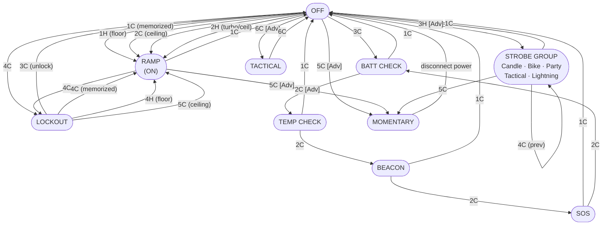

# Anduril UI Navigation Diagram

> `[Adv]` = Advanced UI only  
> `[Simp]` = Simple UI only  
> Button notation: `1C` = 1 click, `1H` = hold, `2C` = 2 clicks, etc.

---

## Main State Flow



---

## Simple UI vs Advanced UI Toggle

```
OFF (Simple UI) ──── 10H ────► Advanced UI
OFF (Adv UI)    ──── 10C ────► Simple UI
```

See [Simple UI](anduril-manual.md#simple-ui) and [Advanced UI](anduril-manual.md#advanced-ui) in the manual.

---

## Navigation Tree (text summary)

**OFF**
├── `1C` ──────────────────► [RAMP (ON)](#ramp-on) — memorized level
├── `1H` ──────────────────► [RAMP (ON)](#ramp-on) — floor level
├── `2C` ──────────────────► [RAMP (ON)](#ramp-on) — ceiling level
├── `2H` [Simp] ───────────► [RAMP (ON)](#ramp-on) — momentary ceiling
├── `2H` [Adv] ────────────► [RAMP (ON)](#ramp-on) — momentary turbo
├── `3C` ──────────────────► [BATT CHECK](anduril-manual.md#battery-check)
│   ├── `1C` ──────────────► OFF
│   ├── `2C` [Adv] ────────► [TEMP CHECK](anduril-manual.md#temperature-check)
│   │   ├── `1C` ──────────► OFF
│   │   ├── `2C` ──────────► [BEACON](anduril-manual.md#beacon-mode)
│   │   │   ├── `1C` ──────► OFF
│   │   │   ├── `1H` ──────► Configure timing
│   │   │   └── `2C` ──────► [SOS](anduril-manual.md#sos-mode)
│   │   │       ├── `1C` ──► OFF
│   │   │       └── `2C` ──► BATT CHECK (cycles back)
│   │   └── `7H` ──────────► Thermal config menu
│   │       ├── Item 1: Current temperature calibration
│   │       └── Item 2: Temperature limit
│   └── `7H` ──────────────► Voltage config menu
│       ├── Item 1: Voltage correction factor
│       ├── Item 2: Post-off voltage display timeout
│       ├── Item 3: Aux low ramp level
│       └── Item 4: Aux high ramp level
│
├── `3H` [Adv] ────────────► [STROBE GROUP](anduril-manual.md#strobe--mood-modes) (last used)
│   ├── Candle
│   ├── Bike Flasher
│   ├── Party Strobe
│   ├── Tactical Strobe
│   └── Lightning Storm
│   *(in any strobe mode:)*
│   ├── `1C` ──────────────► OFF
│   ├── `2C` ──────────────► Next strobe mode
│   ├── `4C` ──────────────► Prev strobe mode
│   ├── `5C` ──────────────► [MOMENTARY](anduril-manual.md#momentary-mode) (using current strobe)
│   └── `1H` / `2H` ───────► Brighter/faster · Dimmer/slower
│
├── `4C` ──────────────────► [LOCKOUT](anduril-manual.md#lockout-mode)
│   ├── `1H` / `2H` ───────► Momentary moon (floor / mem level)
│   ├── `3C` ──────────────► Unlock → OFF
│   ├── `3H` ──────────────► Next [channel mode](anduril-manual.md#channel-modes)
│   ├── `4C` ──────────────► Unlock → RAMP (memorized)
│   ├── `4H` ──────────────► Unlock → RAMP (floor)
│   ├── `5C` ──────────────► Unlock → RAMP (ceiling)
│   ├── `7C` [Adv] ────────► Aux LEDs: next pattern
│   ├── `7H` [Adv] ────────► Aux LEDs: next color
│   └── `10H` [Adv] ───────► Auto-lock config menu
│       └── Item 1: Timeout in minutes (0 = disabled)
│
├── `5C` [Adv] ────────────► [MOMENTARY](anduril-manual.md#momentary-mode)
│   └── Disconnect power ──► OFF (exit only)
│
├── `6C` [Adv] ────────────► [TACTICAL](anduril-manual.md#tactical-mode)
│   ├── `1H` ──────────────► High (slot 1)
│   ├── `2H` ──────────────► Low (slot 2)
│   ├── `3H` ──────────────► Strobe (slot 3)
│   ├── `6C` ──────────────► OFF
│   └── `7H` ──────────────► [Tactical config menu](anduril-manual.md#tactical-mode)
│       ├── Item 1: Slot 1 brightness/mode
│       ├── Item 2: Slot 2 brightness/mode
│       └── Item 3: Slot 3 brightness/mode
│
├── `7C` [Adv] ────────────► [Aux LEDs](#aux-led-behaviour): next pattern
├── `7H` [Adv] ────────────► [Aux LEDs](#aux-led-behaviour): next color
│
├── `9H` [Adv] ────────────► [Misc config menu](anduril-manual.md#misc-config-menu)
│   ├── Item 1: Tint ramp style (on some lights)
│   └── Item 2: Jump start level (on some lights)
│
├── `10C` [Adv] ───────────► Switch to [Simple UI](anduril-manual.md#simple-ui)
├── `10H` [Simp] ──────────► Switch to [Advanced UI](anduril-manual.md#advanced-ui)
├── `10H` [Adv] ───────────► [Simple UI ramp config menu](anduril-manual.md#configuring-simple-ui)
│   ├── Item 1: Floor
│   ├── Item 2: Ceiling
│   ├── Item 3: Steps
│   └── Item 4: Turbo style
│
├── `13H` ─────────────────► [Factory Reset](anduril-manual.md#factory-reset) (some lights)
└── `15C+` ────────────────► [Version Check](anduril-manual.md#version-check-mode)

**[RAMP (ON)](anduril-manual.md#ramping--stepped-ramping-modes)**
├── `1C` ──────────────────► OFF
├── `1H` ──────────────────► Ramp up (reverses if released < 1s ago)
├── `2H` ──────────────────► Ramp down
├── `2C` ──────────────────► Go to / from turbo or ceiling (configurable)
├── `3C` [Adv] ────────────► Toggle ramp style (smooth / stepped)
│                             (or next [channel mode](anduril-manual.md#channel-modes) on multi-channel lights)
├── `6C` [Adv] ────────────► Toggle ramp style (on multi-channel lights)
├── `3H` [Adv] ────────────► Momentary turbo (or tint ramp if channel supports it)
├── `4H` [Adv] ────────────► Momentary turbo (on multi-channel lights)
├── `4C` ──────────────────► [LOCKOUT](anduril-manual.md#lockout-mode)
├── `5C` [Adv] ────────────► [MOMENTARY](anduril-manual.md#momentary-mode)
├── `5H` [Adv] ────────────► [Sunset timer](anduril-manual.md#sunset-timer) (+5 min per hold)
├── `7H` [Adv] ────────────► [Ramp config menu](anduril-manual.md#ramp-config-menu)
│   ├── Item 1: Floor level
│   ├── Item 2: Ceiling level
│   └── Item 3: Steps / speed
├── `9H` [Adv] ────────────► [Channel mode](anduril-manual.md#channel-modes) enable/disable menu
│                             (multi-channel lights only)
├── `10C` [Adv] ───────────► Enable manual memory, save current brightness
└── `10H` [Adv] ───────────► [Ramp extras config menu](anduril-manual.md#ramping--stepped-ramping-modes)
    ├── Item 1: Auto vs manual memory
    ├── Item 2: Manual mem timer
    ├── Item 3: Ramp-after-moon
    ├── Item 4: Turbo style
    └── Item 5: Smooth steps

---

## Aux LED Behaviour

> Full details in the manual: [Aux LEDs / Button LEDs](anduril-manual.md#aux-leds--button-leds)

The small LEDs (aux or button LEDs) indicate the light's status while the main beam is off.
You can set a different pattern for **Off** mode and **Lockout** mode — so you can tell at a glance whether the light is locked.

| Button | Where | What it does |
|--------|-------|--------------|
| `7C` | Off or Lockout | Switch to the next pattern |
| `7H` | Off or Lockout | Switch to the next color (RGB lights only) |

---

### Patterns

Each `7C` press steps to the next pattern:

Off → Low → High → Blinking → Heartbeat → Breathing → Pulse → *(back to Off)*

| Pattern | What you see |
|---------|-------------|
| **Off** | Dark — aux LEDs stay off |
| **Low** | Steady dim glow |
| **High** | Steady bright glow |
| **Blinking** | Occasional flash with a short dim pulse, then a long dark pause |
| **Heartbeat** | Two quick pulses (strong then weak), then a long pause — like a heartbeat |
| **Breathing** | Smoothly fades in, then slowly fades out, then pauses |
| **Pulse** | Blinks to show battery level — see below |

> Heartbeat, Breathing, and Pulse are only available on lights with enough memory.

#### Pulse — battery level indicator

**On lights with a single-color aux LED:**

| Battery level | What you see |
|---------------|-------------|
| Good (above ~50%, ≥ 3.7 V) | 1 short flash, long pause |
| Medium (below ~50%, < 3.7 V) | 2 short flashes, long pause |

**On lights with RGB aux LEDs:**

| Battery level | What you see |
|---------------|-------------|
| Good (≥ 3.5 V) | 1 dim flash, long pause |
| Medium (3.3 – 3.5 V) | 2 dim flashes, long pause |
| Low (< 3.3 V) | 1 dim flash + 1 bright flash, long pause |

---

### Colors (RGB lights only)

Each `7H` press steps to the next color:

Red → Yellow → Green → Cyan → Blue → Purple → White → Disco → Rainbow → Voltage → *(back to Red)*

| Color | Description |
|-------|-------------|
| **Red … White** | Steady color of your choice |
| **Disco** | Randomly jumps between colors |
| **Rainbow** | Slowly cycles through all colors in order |
| **Voltage** | Color shows battery charge — see below |

#### Voltage color — battery charge at a glance

| Color | Battery voltage | Charge level |
|-------|----------------|--------------|
| Off | below 2.9 V | Dead / critically empty |
| Red | 2.9 – 3.3 V | Very low |
| Yellow | 3.3 – 3.5 V | Low |
| Green | 3.5 – 3.7 V | Medium |
| Cyan | 3.7 – 3.9 V | Good |
| Blue | 3.9 – 4.1 V | High |
| Purple | 4.1 – 4.4 V | Very high |
| White | ≥ 4.4 V | Full |

---

### Low battery warnings

| Situation | What happens |
|-----------|-------------|
| Battery critically empty (below 2.9 V) | Aux LEDs turn off completely |
| Battery low (below 3.3 V), single-color light | Aux LED fast-blinks as a warning, regardless of your pattern setting |

---

### Voltage flash after turn-off

> See [Post-Off Voltage Display](anduril-manual.md#post-off-voltage-display-povd) in the manual.

On RGB lights, for a few seconds after you turn the light off, the aux LEDs automatically switch to **Voltage color** mode so you can quickly check the battery. After that, they return to your chosen pattern.

- Duration is adjustable (default: 4 seconds) in the Voltage config menu (Batt Check → `7H`, item 2).
- Set it to 0 to turn this feature off.

How bright the flash appears depends on how bright the main light was before you turned it off — brighter use = brighter voltage flash.

---

### Button LED while light is on

On lights with a button LED, the button glows while the main beam is on:

| Brightness level | Button LED |
|-----------------|-----------|
| Very low (below the configured low threshold) | Off |
| Low to medium | Dim |
| High (above the configured high threshold) | Bright |

The thresholds are configurable in the Voltage config menu (Batt Check → `7H`, items 3 and 4).

---

## Config Menu Navigation

> See [Configuration Menus](anduril-manual.md#configuration-menus) in the manual.

All config menus share the same interaction pattern:

```
Enter menu (e.g. 7H)
  │
  ▼
Blink 1 ── Hold: skip ──► Blink 2 ── Hold: skip ──► ... ──► Exit
           │
           Release
           │
           ▼
        Number entry: click (+1), hold (+10), wait to confirm
```
